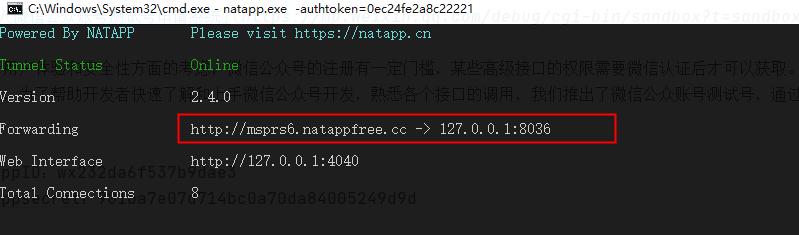
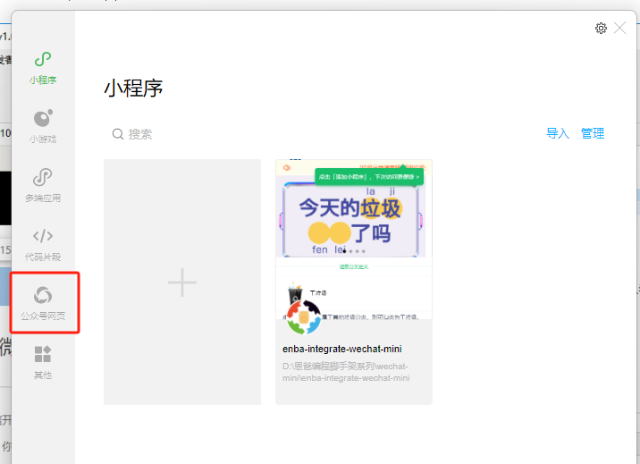
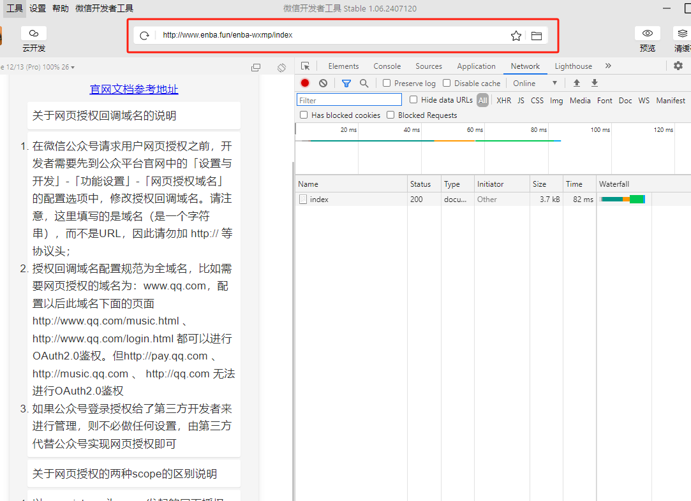
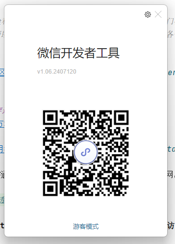
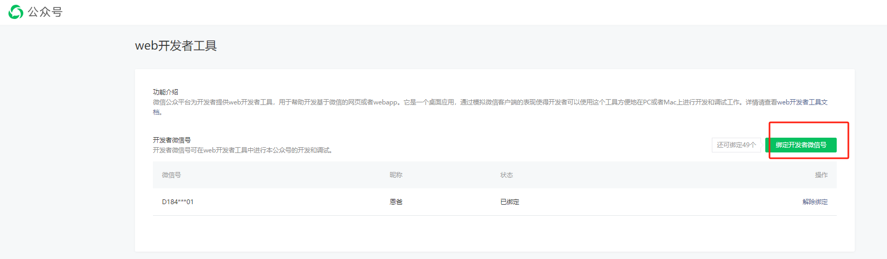
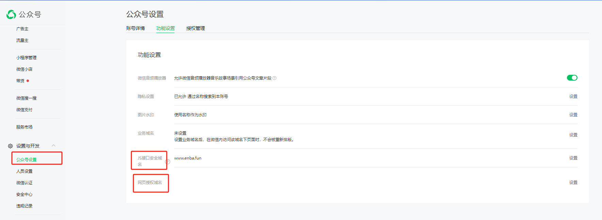
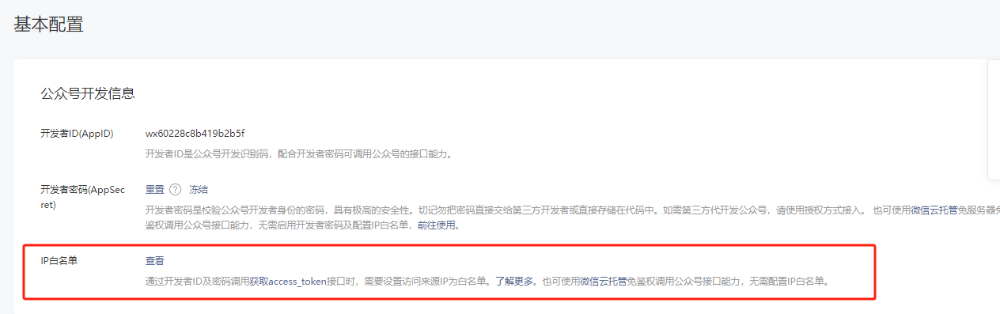

## 恩爸编程【只讲有用的】[仓库地址](https://gitee.com/mn_cxy/enba-integrate-wxmp)

该项目是一个springboot集成**微信公众号**的案例,拿来就能用在自己的项目中。


**开始之前，分享一下整个对接的流程。本案例讲的是对接微信公众号，其实对接任何一家第三方的流程基本都是一致的，基本就是以下步骤**
* 申请开发者
* 注册项目
* 阅读第三方开发文档（本案例就是https://developers.weixin.qq.com/doc/offiaccount/Getting_Started/Overview.html）
* 编码对接
    * 需要先获取第三方授权令牌或者说token
    * 拿着第三方发放的token请求第三方的各种开放的业务接口
* 测试环境测试效果
* 上线
  **其实只要在开发前仔细阅读第三方提供的文档，这个文档可能是在线的，也可能是一个线下的文档之类的，都无所谓，主要就是要按照文档一步一步来。当碰到问题时可以进行咨询，比较有实力的第三方可以提在线工单，有相应的开发者社区，没实力的大不了就是钉钉，微信沟通解决**


* [获取Access token示例](src/main/java/com/enba/integrate/wxmp/controller/AccessTokenController.java) **【点我】**
* [客服消息示例](src/main/java/com/enba/integrate/wxmp/controller/KfMessageController.java) **【点我】**
* [素材管理示例](src/main/java/com/enba/integrate/wxmp/controller/MediaController.java) **【点我】**
* [网页授权示例](src/main/java/com/enba/integrate/wxmp/controller/Oauth2AuthorizeController.java) **【点我】**
* [二维码示例](src/main/java/com/enba/integrate/wxmp/controller/QrCodeController.java) **【点我】**
* [模版消息示例](src/main/java/com/enba/integrate/wxmp/controller/TemplateMsgController.java) **【点我】**
* [验证url有效性示例](src/main/java/com/enba/integrate/wxmp/controller/VerifyUrlEffectController.java) **【点我】**
* [自定义菜单示例](src/main/java/com/enba/integrate/wxmp/controller/WxMpMenuController.java) **【点我】**
* [基础消息能力示例](src/main/java/com/enba/integrate/wxmp/controller/WxMpMsgController.java) **【点我】**

---
[微信公众号官方文档](https://developers.weixin.qq.com/doc/offiaccount/Getting_Started/Overview.html)

### 接口测试号申请
[进入微信公众账号测试号申请系统](https://mp.weixin.qq.com/debug/cgi-bin/sandbox?t=sandbox/login)

```
由于用户体验和安全性方面的考虑，微信公众号的注册有一定门槛，某些高级接口的权限需要微信认证后才可以获取。
所以，为了帮助开发者快速了解和上手微信公众号开发，熟悉各个接口的调用，我们推出了微信公众账号测试号，通过手机微信扫描二维码即可获得测试号。
```

[微信开放社区，有问题可以在这里搜](https://developers.weixin.qq.com/community/pay)

---
#### 内网穿透工具
[natapp官方地址](https://natapp.cn/)

[natapp使用教程](https://natapp.cn/article/natapp_newbie)

本地调试，需通过内网穿透工具将本地服务器的端口映射到外网，才能让微信服务器访问到本地服务器。



**访问域名http://msprs6.natappfree.cc相当于本地访问127.0.0.1:8036**

---
#### 微信公众号开发调试工具
[工具地址](https://developers.weixin.qq.com/doc/offiaccount/OA_Web_Apps/Web_Developer_Tools.html)


**微信公众平台为开发者提供web开发者工具，用于帮助开发基于微信的网页或者webapp。它是一个桌面应用，通过模拟微信客户端的表现使得开发者可以使用这个工具方便地在PC或者Mac上进行开发和调试工作。**

---

**注意！！！** 进入这个工具前需要扫码登陆



---
**另外，这个扫码微信号需要在公众号后台添加为开发者微信号**


---

**[微信授权登录](https://developers.weixin.qq.com/doc/offiaccount/OA_Web_Apps/Wechat_webpage_authorization.html)**


---

**如果需要获取微信用户信息，需要配置IP白名单**



---

**任何疑问添加微信咨询**
